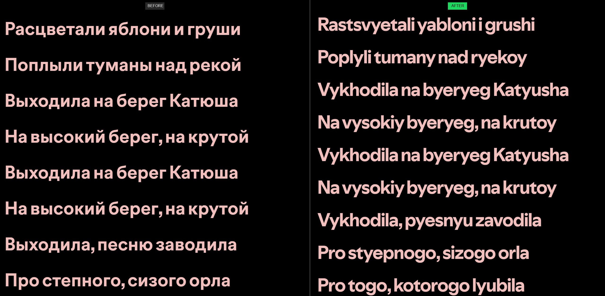

<div align="center">

# Russian Lyrics Romanizer

A [Spicetify](https://spicetify.app) extension that converts Russian Cyrillic lyrics into phonetic English.

[](LICENSE)
[](https://spicetify.app)

<br>


</div>

---

## What it does

When you open Spotify's lyrics view on a Russian song, this extension transliterates the Cyrillic text into English characters in real-time. 

**Before:**
> Я хочу, чтобы ты была счастлива

**After:**
> Ya khochu, chtoby ty byla schastliva

It adds a toggle button in the top bar so you can easily switch it on and off. It only affects Russian characters, so it won't mess up mixed-language lyrics.

## Installation

### Spicetify Marketplace (Recommended)
Search for "Russian Lyrics Romanizer" in the Spicetify Marketplace and click install.

### Manual install
1. Download `russian-romanizer.js` from this repository.
2. Drop it into your Spicetify extensions folder:
   - **Windows:** `%appdata%\spicetify\Extensions\`
   - **Mac/Linux:** `~/.config/spicetify/Extensions/`
3. Run these commands:
   ```bash
   spicetify config extensions russian-romanizer.js
   spicetify apply
   ```

## Usage

After installing, you'll notice a new **Я** icon in the Spotify top bar. 
Click it to toggle the romanizer on or off. The extension remembers your choice, so you don't have to keep clicking it every time you restart Spotify.

## The transliteration

The conversion is mostly based on the BGN/PCGN standard, but tweaked slightly so it's easier to casually read and sing along to. It handles context-dependent vowels (like Е and Ё) differently depending on whether they appear at the start of a word, after another vowel, or after a consonant. 

## Technical details

The extension hooks into the Spotify DOM and uses a `requestAnimationFrame` loop to catch and update lyrics as they scroll without causing flickering. To keep performance tight, it caches the original Cyrillic strings in a `WeakMap`. This means toggling the extension off restores the original text instantly without chewing up your CPU.

## Contributing

If you find any bugs or have ideas for improving the transliteration logic, feel free to open an issue or submit a PR.

## License

[MIT](LICENSE)
